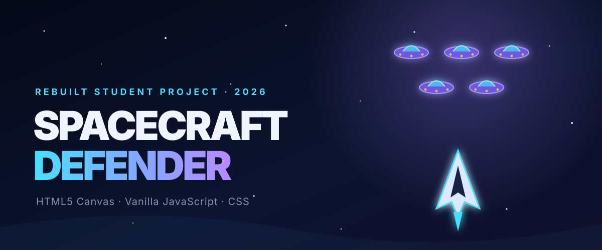

# Spacecraft Defender



Spacecraft Defender is a browser game where you move a spacecraft, shoot enemy UFOs, collect power-ups, and try to survive as many waves as possible.

I first made a version of this game in 2021 while I was learning JavaScript at school. It worked, but the code had a separate variable and collision check for almost every enemy. I came back to the project in 2026 and rebuilt it so the game would be smoother, easier to maintain, and more enjoyable to play.

I used AI to help with parts of the refactor and visual design. The original project and game idea are mine, and I directed the rebuild. I am reviewing the new code and using the [learning notes](docs/LEARNING-NOTES.md) to better understand how each part works.

## Play the game

[Play Spacecraft Defender online](https://sanathnarayana.github.io/spacecraft-defender/)

To run it locally, start a simple web server in the project folder:

```bash
python3 -m http.server 4317 --bind 127.0.0.1
```

Then open `http://localhost:4317` in your browser. There is no installation or build step.

## Controls

| Action | Keyboard | Touch |
| --- | --- | --- |
| Move | `A` / `D` or arrow keys | Left and right buttons |
| Fire | `Space` | Fire button |
| Pause | `P` or `Esc` | — |
| Turn sound on or off | `M` | — |

You can also drag across the game area to move the spacecraft on devices that support pointer input.

## What is in the game

- Enemy waves that become faster and more difficult
- Shield and rapid-fire power-ups
- Score, health, wave, and high-score tracking
- Keyboard, touch, and pointer controls
- Pause, game-over, and restart screens
- Particle effects, screen shake, moving stars, and sound effects
- A responsive layout for desktop and mobile screens

## What I changed

The biggest change was replacing the repeated enemy code with arrays and reusable classes. Enemies, bullets, particles, and power-ups can now be created and updated through the same shared logic.

I also added a single animation loop, clearer game states, mobile controls, locally saved high scores, sound effects, and a basic smoke test for the main gameplay flow.

## Project structure

```text
spacecraft-defender/
├── assets/          # Images from my original school project
├── docs/            # Project banner and learning notes
├── src/game.js      # Gameplay, input, drawing, and sound
├── tests/            # Basic gameplay smoke test
├── index.html        # Game page and interface
└── style.css         # Layout and visual design
```

The project uses HTML5 Canvas, vanilla JavaScript, CSS, the Web Audio API, and the browser's Local Storage API.

## What I learned

Revisiting this project showed me why reusable objects and shared functions are better than writing almost the same code many times. It also gave me a practical introduction to game states, frame-based animation, collision detection, responsive controls, and organising a larger JavaScript file.

## Ideas for later

- Add boss waves and more types of enemy movement
- Let the player choose between different spacecraft
- Build an online leaderboard with an API
- Add more automated gameplay tests

## Author

Made by **Sanath Narayana**<br>
[GitHub](https://github.com/SanathNarayana) · [LinkedIn](https://www.linkedin.com/in/sanath-suresh-a30743376/)
